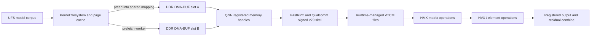

# Hexagon v79 backend: design and implementation status

This branch is an **experimental C99 host foundation**, not a production NPU
inference backend. Base: `7107e3da220cdd85da2cfeaa8911bd313de0b316`.
It leaves existing CPU, CUDA, Vulkan and XDNA paths unchanged. No QNN headers or
libraries are required by the ordinary Colibri build. No model weights or
proprietary SDK files are included in the repository.

## Implemented in this slice

- `c/backends/npu/coli_npu_buf.{h,c}`: Linux DMA-heap allocation, imported DMA-BUF
  ownership, Qualcomm rpcmem allocation by dynamic symbol resolution, cache
  access brackets, and registration references that prevent premature release.
- `coli_npu_qnn.{h,c}`: the actual SDK `memRegister` / `memDeRegister` function
  pointers, `QNN_MEM_TYPE_CUSTOM` + `QNN_HTP_MEM_SHARED_BUFFER`, tensor shape/type
  and range validation, and version-aware MEMHANDLE binding.
- `coli_npu_graph.{h,c}`: HTP-only provider selection, cached context loading,
  graph lookup and synchronous MEMHANDLE execution. Model adapters must supply
  validated graph/tensor metadata; binary conversion is an offline operation.
- `coli_hexagon_engine.{h,c}`: a persistent pthread prefetch reader, exact `pread`
  into the mapped buffer, two reusable slots, synchronous device ownership,
  dependency-ordered model callbacks, and poisoned-token failure handling.
- `coli setup --backend hexagon` and `c/setup.sh --backend hexagon`: an explicit
  Android support-library build. These commands do **not** enable NPU inference.
- Host tests for multi-layer/multi-token ordering, slot ownership, rejected
  ranges, short reads, and failures. Compilation with QAIRT 2.37 headers and
  Android NDK r28c is a build check, not device/numerical qualification.

## Initial model target

The starting target is
[`huihui-ai/Huihui-Qwen3.6-35B-A3B-abliterated`](https://huggingface.co/huihui-ai/Huihui-Qwen3.6-35B-A3B-abliterated),
revision `8f0ee727aff5e771ea72466d64d13ecd851d2cc7` (verified 2026-10-08).
The published text configuration is `qwen3_5_moe_text`: 40 layers, hidden size
2048, 256 routed experts, eight selected experts per token, and expert width 512.
Its layer pattern is three linear-attention blocks followed by full attention.
Implementing ordinary MHA/MLA alone does not implement this model.
Existing private expert corpora containing 41 layers need explicit main-model vs
auxiliary/MTP provenance validation before being used for full inference.

The newer
[`Huihui-Qwen3.8-Flash-Next-abliterated`](https://huggingface.co/huihui-ai/Huihui-Qwen3.8-Flash-Next-abliterated)
exists, but its repository reports approximately 180B parameters, not 35–37B.
Revision `298f94632b784e26a7fe576114f82066689d5baa` has a different
`qwen4_exp_text` configuration: hidden size 2560, 48 layers, 512 experts and
10 selected experts. It is a separate integration and capacity target.

## Physical and software boundary



`pread` still copies from the kernel into the application mapping. This design
eliminates an **additional application staging memcpy**. It does not claim
peer-to-peer UFS-to-VTCM DMA, pinned flash pages, or an absence of internal QNN
layout copies. `O_DIRECT` would need independent alignment/filesystem/exporter
qualification; `io_uring` does not itself remove the kernel copy or grant device
access. A bounded pthread reader is the minimal portable baseline.

DMA-BUF is DDR-backed shared memory, **not VTCM**. Registering an FD does not move
or pin its contents in VTCM. With signed QNN, the compiler/runtime owns VTCM
allocation, tensor tiling, DMA scheduling, HMX/HVX selection and spill/fill.
Host code cannot honestly expose `tcm_dma_start()` as a QNN feature.

A separate custom Hexagon kernel could implement DSP-side ping-pong tiles, but
requires a compatible Hexagon SDK, accessible DMA/VTCM APIs, and permission to
load that DSP code. Retail-device signing/SELinux policy must be checked first.
Do not promise that an unsigned custom skel works on this S25. No hard-coded
VTCM capacity is used: shared capacity and allocation can depend on firmware,
runtime configuration and competing workloads.

### Operator ownership

| Operation | Initial owner | Acceleration qualification |
|---|---|---|
| Tokenization, file IO, scheduling, manifest validation | Oryon CPU | Always host-owned |
| Embedding, RMSNorm, RoPE, KV updates, attention/SSM | Existing model engine | Export exact model semantics into static QNN segments, compare numerically |
| Router projection | CPU baseline; QNN candidate | Matrix portion may use HMX; scheduling chosen by QNN |
| Router Top-k/normalization | Model engine; HVX/element candidate | Preserve model-specific ordering, scaling, ties and normalization |
| Expert gate/up/down GEMM | QNN dynamic-input template candidate | Verify supported dtype, layout, quantization and HMX execution |
| SwiGLU, weighted sum, residual | CPU baseline; QNN candidate | Exact gate weights and accumulator precision are part of model semantics |
| Sampling | Oryon CPU | Preserve baseline sampling behavior |

“Element Accelerator” is an architectural destination, not a public host-side
operator placement command. Actual placement needs the compiler report/profile.
Qwen hybrid attention/SSM must not be silently replaced by generic MLA/MHA.

## Data dependencies and overlap

For a sequential transformer layer, the router typically consumes the
post-attention residual (and its normalization). The next layer's router also
depends on the current layer's expert output. Computing either router before
that input is available changes the model unless an explicit speculative
prediction/miss-recovery scheme is introduced.

The scheduler therefore calls `dense_route` at the **first valid dependency
boundary**, immediately queues the first two reads, runs any truly independent
`dense_tail`, then executes experts in the model adapter's order. Reading slot
B can overlap execution using slot A. After synchronous execution returns,
slot A may be reused for job i+2. No host slot is reused while a device can
still read it. All input errors invalidate the token; a partial KV update must
be discarded/rebuilt by the model adapter, never silently retried.

The public callback seam supports CPU reference operators and precompiled QNN
segments. **The model adapter and dense graphs are not yet implemented here.**
The scheduler is not a substitute for model integration. It does not invent
router outputs, apply a generic Top-k softmax, or re-finalize a graph per expert.

Overlap reduces stalls only if service time permits it. A lower bound is
`token time >= cold expert bytes per token / sustained effective flash bandwidth`,
and device dispatch, quantization, dense computation and thermal throttling add
cost. With no reuse, 3–4B parameters stored at four bits represent 1.5–2.0 GB;
the actual expert-only traffic must be measured. No tokens/second claim is made.

## Memory and quantization contracts

- Corpus manifest must pin model revision, architecture, tensor names/shapes,
  expert IDs, byte ranges, file digests, quantization/scales/zero points, packing,
  byte order, and required graph/runtime version. Corpus is immutable while open.
- Dense weights, activation scratch and KV cache are separate from the two
  streaming buffers. Memory budget includes QNN context, RPC buffers and Android.
- INT4 and FP4 are different representations. Neither can be passed as arbitrary
  bytes to an 8/16-bit graph input. Generic GGUF support is not Colibri native
  format support; use an explicit converter with numerical validation.
- The initial QNN registration adapter deliberately accepts only supported
  byte-addressable dtypes. A 4-bit-on-disk corpus may require CPU unpacking or
  requantization into the execution format. That expansion changes memory and
  bandwidth calculations and must be explicit in the model adapter.
- Static QNN weights may be transformed at graph finalization. They cannot be
  replaced with raw expert bytes simply by changing a pointer. Runtime-input
  MatMul and resident compiled expert contexts are separate paths with separate
  performance profiles. Existing experiments should be reproduced before use.
- Register each tensor slice in each buffer once, with correct dataType and
  dimensions. Bind MEMHANDLE tensors; do not mix them with RAW client buffers.
- CPU writes are bracketed with `DMA_BUF_IOCTL_SYNC START/WRITE` and `END/WRITE`.
  CPU output reads use READ. Unsupported coherency ioctls fail rather than
  silently claiming coherence. An older ION platform requires a separately
  tested exporter-specific adapter, not an unconditional `ion_sync_fd` call.
- These ioctls manage caches, **not execution fences**. Graph completion or an
  explicit completion signal is required before reusing buffers. Destroy joins
  the reader; deregistration precedes buffer release; context/library teardown
  follows all registrations. Buffers remain retained on deregistration failure.
- `AHardwareBuffer` native handles are opaque and exporter-specific. Assuming
  `native_handle->data[0]` is a linear QNN-compatible FD is not portable. This
  implementation selects the explicit DMA-BUF/rpcmem route. A future AHB adapter
  must use BLOB allocations, lock/unlock/fence contracts and a qualified importer.

## Build and runtime contract

```sh
export ANDROID_NDK_ROOT=/path/to/android-ndk-r28c
export QNN_SDK_ROOT=/path/to/qairt/2.37.0.250724
export ANDROID_API=28
./c/coli setup --backend hexagon
# Equivalent: bash c/setup.sh --backend hexagon
make -C c/backends/npu test
# On the phone, in native Termux with the SDK headers staged separately:
COLI_HEXAGON_NATIVE=1 QNN_SDK_ROOT="$HOME/sdk/qairt-2.37" ./c/coli setup --backend hexagon
```

`NDK_HOST_TAG` defaults to `linux-x86_64`; set a supported installed host tag
when appropriate. The standard Linux NDK host tools are not Android ARM64
executables. Termux clang can build ordinary Android-native host C code on the
phone; QNN model conversion/context generation remains on a supported SDK host.
Use the SDK headers only at build time. Link the resulting host application
with `-ldl -pthread`; load a version-matched QNN backend/stub/signed skel at runtime.
Respect Qualcomm redistribution terms; the open-source C wrapper does not make
vendor binaries open-source or optional for NPU execution.

Proposed environment contract, **not yet wired into inference**:

| Variable | Contract |
|---|---|
| `COLI_HEXAGON=0` (default) | Ordinary engine behavior |
| `COLI_HEXAGON=1` | Explicit opt-in after model/device qualification; report capability failures |
| `COLI_NPU_BURST_MODE=0` (default) | Normal device power policy |
| `COLI_NPU_BURST_MODE=1` | Request a supported bounded QNN performance hint; never disable thermal protection |
| `COLI_HEXAGON_NATIVE=1` | Build helper: use a verified Android aarch64 native clang instead of the host NDK |

The runtime opt-in and burst variables do not currently activate this library. Burst configuration needs
QNN HTP performance-infrastructure integration and device validation. A future
strict-NPU option should fail if unavailable; mixed execution must report actual
placement. No fake CPU-success response should be labelled NPU execution.

## Remaining acceptance gates

1. Integrate the exact model family and manifest into Colibri's existing forward
   loop. Export dense segments, router semantics, and dynamic expert template.
2. Check individual expert outputs, full-layer outputs, multi-token KV behavior,
   and greedy decode against the CPU reference on recorded input vectors.
3. Measure cold/warm UFS reads, registration overhead, graph dispatch, HMX cycles,
   temperatures, power and sustained generation. Prove actual overlap by traces.
4. Add cancellation/timeouts, thermal/power policy, model-specific fallback and
   crash/restart validation before a production release. The current blocking
   reader can delay destruction while a kernel read is outstanding.

### Device checks on 2026-10-08

- SM-S938W / SM8750, Android 16, ADB shell UID 2000.
- Android-native scheduler test passed on device (host test buffers, not NPU).
- `coli_hexagon_probe` passed with the existing QAIRT 2.37 bundle: QNN core API
  2.27, backend/device/context creation, rpcmem allocation from the vendor
  `libcdsprpc.so`, DMA-BUF CPU cache brackets, custom shared-buffer registration,
  deregistration and cleanup. No inference graph was executed by this probe.
- After rebuilding the phone environment, native Termux Clang 21.1.8 built
  the support library, passed the scheduler tests and built the existing CPU
  `qwen36` executable. The static expert harness executed directly as Termux
  UID 10325, reproducing cosine **0.999556502**, relative L2 **0.029815480** and
  exit status 0 including cleanup. No ADB execution bridge was needed for this
  signed QNN path. The dynamic two-slot test also reproduced both results and
  the known E1 accuracy failure in this domain. This does not grant arbitrary
  DSP kernel loading or establish HMX utilization. Ubuntu PRoot adds no device
  privileges; these NPU checks ran in native Termux.
- The firmware QNN backend was rejected for API incompatibility with these
  headers. Do not bypass version selection.
- Initial teardown crashed after otherwise successful memory operations.
  Keeping vendor QNN/RPC code mapped with `RTLD_NODELETE` fixed the observed
  unload failure. Allocations and QNN handles are still explicitly released;
  library code remains resident until process exit.
- The new C cached-graph wrapper then executed the existing `expert_v79.bin`
  fixture (`expert` graph, input `x` ID 1, output `y` ID 10, both shape [1,2048],
  UFIXED16 with the export's actual scale/offset). Against its saved FP32
  reference: cosine **0.999556502**, relative L2 **0.029815480**. Exit status 0,
  including deregistration and context/device/backend cleanup. This validates
  one static quantized expert; it is not full-model inference, streamed INT4,
  nor a fresh HMX utilization/power/throughput profile.


- A second device test connected the real scheduler to `dyn_v79.bin`, using two
  6 MiB rpcmem slots and three registered UFIXED16 weight slices per slot. The
  `pread` worker replayed actual layer-0 experts in order E0, E1, E1, E0, forcing
  both experts through both slots. Repeated outputs were bit-identical across
  slots. E0 cosine was **0.999510024**, relative L2 **0.031315431**; E1 cosine was
  **0.996964148**, relative L2 **0.090271752** against FP32 CPU references.
  The test deliberately **failed** its preselected cosine >= 0.999 and relative
  L2 <= 0.05 acceptance threshold. This verifies buffer reuse and dynamic graph
  execution, but does not qualify this graph's calibration for arbitrary experts.
  Seven E1 up-projection weights clipped at the template's fixed quantization
  range; that observation alone does not establish the full cause of the error.
  Routing here was an explicit replay fixture, not a model router. Weights were
  UFIXED16 execution tensors, not streamed INT4. No overlap speedup was measured.

Fixture SHA-256 (existing private regression assets, not repository downloads):

| File | SHA-256 |
|---|---|
| `expert_v79.bin` | `e97b200486bc5520d227ecd1ead42a73ce20e7d51351d1c60a87f0051f549f85` |
| `input_x.raw` | `fae52d1028212815b787c1cb96f6cb71c9798e1482efa82e0bf7ad1c375fcf52` |
| `ref_y.raw` | `ec20478f2949f6f848f32ebd4af67421cef4f1df701de4521f387928bac7bbef` |

## Sources

- [Qualcomm shared buffers](https://docs.qualcomm.com/nav/home/htp_shared_buffer_tutorial.html?product=924033590759186372)
- [Linux DMA-BUF ownership, coherency and fences](https://docs.kernel.org/driver-api/dma-buf.html)
- [Android AHardwareBuffer contracts](https://developer.android.com/ndk/reference/group/a-hardware-buffer)
- Locally inspected licensed QAIRT 2.37 `QnnMem.h`, `QnnInterface.h`, and
  `HTP/QnnHtpMem.h`; these remain outside the repository.
